# Futured GitHub configuration

## Reusable workflows

This repo contains reusable workflows. These workflows are automatically
set up when creating projects using
[iOS project template](https://github.com/futuredapp/iOS-project-template).

If you want to import them manually, reference a reusable workflow in your trigger workflow:

```yml
jobs:
  { name }:
    uses: futuredapp/.github/.github/workflows/{platform}-{runner}-{action}.yml@1.0.0
    secrets:
      # Secrets to be passed to called workflow
      key: ${{ secrets.key }}
```

Name the job first and choose its platform, runner and action.
Check the reusable workflow file and pass all the required secrets to it.
All the available reusable workflows are listed in the following table.

### Available workflows

| Platform       | Runner      | Action                      | File                                                                                                                   | Description                                                                            |
|:---------------|:------------|:----------------------------|:-----------------------------------------------------------------------------------------------------------------------|:---------------------------------------------------------------------------------------|
| Universal      | Any         | Workflows Lint              | [`workflows-lint`](.github/workflows/workflows-lint.yml)                                                               | Lints GitHub workflow files for syntax and best practices.                             |
| Universal      | Cloud       | Backup                      | [`universal-cloud-backup`](.github/workflows/universal-cloud-backup.yml)                                               | Backups currently checked out ref to a remote repository.                              |
| Universal      | Self-hosted | Backup                      | [`universal-selfhosted-backup`](.github/workflows/universal-selfhosted-backup.yml)                                     | Backups currently checked out ref to a remote repository.                              |
| iOS            | Self-hosted | Test                        | [`ios-selfhosted-test`](.github/workflows/ios-selfhosted-test.yml)                                                     | Lints and tests the PR.                                                                |
| iOS            | Self-hosted | Build                       | [`ios-selfhosted-build`](.github/workflows/ios-selfhosted-build.yml)                                                   | Creates enterprise release build and submits the build to Futured App Store Connect.   |
| iOS            | Self-hosted | Release                     | [`ios-selfhosted-release`](.github/workflows/ios-selfhosted-release.yml)                                               | Creates release build and submits it to App Store Connect.                             |
| iOS (KMP)      | Self-hosted | Test                        | [`ios-kmp-selfhosted-test`](.github/workflows/ios-kmp-selfhosted-test.yml)                                             | Lints and tests the PR.                                                                |
| iOS (KMP)      | Self-hosted | Build                       | [`ios-kmp-selfhosted-build`](.github/workflows/ios-kmp-selfhosted-build.yml)                                           | Creates enterprise release build and submits the build to Futured App Store Connect.   |
| iOS (KMP)      | Self-hosted | Release                     | [`ios-kmp-selfhosted-release`](.github/workflows/ios-kmp-selfhosted-release.yml)                                       | Creates release build and submits it to App Store Connect.                             |
| Android (+KMP) | Cloud       | Tests & Lint checks         | [`android-cloud-check`](.github/workflows/android-cloud-check.yml)                                                     | Runs unit tests and lint checks on pull request.                                       |
| Android (+KMP) | Cloud       | Firebase Snapshot Release   | [`android-cloud-release-firebaseAppDistribution`](.github/workflows/android-cloud-release-firebaseAppDistribution.yml) | Publishes QA Snapshot build to Firebase App Distribution.                              |
| Android (+KMP) | Cloud       | Google Play Release         | [`android-cloud-release-googlePlay`](.github/workflows/android-cloud-release-googlePlay.yml)                           | Publishes release build to Google Play.                                                |
| Android        | Cloud       | Nightly Build               | [`android-cloud-nightly-build`](.github/workflows/android-cloud-nightly-build.yml)                                     | Automated nightly builds with Firebase App Distribution deployment.                    |
| Android (+KMP) | Cloud       | Generate Baseline Profiles  | [`android-cloud-generate-baseline-profiles`](.github/workflows/android-cloud-generate-baseline-profiles.yml)           | Generates baseline profiles and creates PR with changes.                               |
| KMP            | Cloud       | Detect Changes              | [`kmp-cloud-detect-changes`](.github/workflows/kmp-cloud-detect-changes.yml)                                           | Detects changed sources in KMP projects for conditional job execution.                 |
| KMP            | Cloud       | Combined Nightly Build      | [`kmp-combined-nightly-build`](.github/workflows/kmp-combined-nightly-build.yml)                                       | Automated nightly builds for both iOS and Android platforms in KMP projects.           |

## Workflow and Action Dependencies

The following diagram shows the relationships between workflows and actions in this repository:

```mermaid
graph TD
    %% Workflow definitions
    subgraph "Workflows"
        WL[workflows-lint]
        UCB[universal-cloud-backup]
        USB[universal-selfhosted-backup]
        IKST[ios-kmp-selfhosted-test]
        IST[ios-selfhosted-test]
        ACC[android-cloud-check]
        ACGBP[android-cloud-generate-baseline-profiles]
        ACNB[android-cloud-nightly-build]
        ACRFAD[android-cloud-release-firebaseAppDistribution]
        ACRGP[android-cloud-release-googlePlay]
        KCDC[kmp-cloud-detect-changes]
        IKSR[ios-kmp-selfhosted-release]
        ISB[ios-selfhosted-build]
        ISR[ios-selfhosted-release]
        IKSB[ios-kmp-selfhosted-build]
        KCNB[kmp-combined-nightly-build]
    end

    %% Action definitions
    subgraph "Actions"
        ASE[android-setup-environment]
        AC[android-check]
        ABF[android-build-firebase]
        ABGP[android-build-googlePlay]
        AGBP[android-generate-baseline-profiles]
        KDC[kmp-detect-changes]
        UDCGC[universal-detect-changes-and-generate-changelog]
        IES[ios-export-secrets]
        IB[ios-build]
    end

    %% Android workflow dependencies
    ACC --> ASE
    ACC --> AC

    ACGBP --> ASE
    ACGBP --> AGBP

    ACNB --> UDCGC
    ACNB --> ASE
    ACNB --> ABF

    ACRFAD --> ASE
    ACRFAD --> ABF

    ACRGP --> ASE
    ACRGP --> ABGP

    %% iOS workflow dependencies
    IKSB --> ASE
    IKSB --> IB

    IKSR --> IES

    ISB --> UDCGC
    ISB --> IES

    ISR --> IES

    %% KMP workflow dependencies
    KCDC --> KDC

    KCNB --> UDCGC
    KCNB --> ASE
    KCNB --> IB
    KCNB --> ABF

    %% Styling
    classDef workflowAndroid fill:#4CAF50,stroke:#2E7D32,stroke-width:2px,color:#fff
    classDef workflowIOS fill:#2196F3,stroke:#1565C0,stroke-width:2px,color:#fff
    classDef workflowKMP fill:#FF9800,stroke:#E65100,stroke-width:2px,color:#fff
    classDef workflowUniversal fill:#9C27B0,stroke:#4A148C,stroke-width:2px,color:#fff
    classDef actionAndroid fill:#A5D6A7,stroke:#2E7D32,stroke-width:2px
    classDef actionIOS fill:#90CAF9,stroke:#1565C0,stroke-width:2px
    classDef actionUniversal fill:#CE93D8,stroke:#4A148C,stroke-width:2px

    %% Apply styling
    class ACC,ACGBP,ACNB,ACRFAD,ACRGP workflowAndroid
    class IST,ISB,ISR,IKST,IKSB,IKSR workflowIOS
    class KCDC,KCNB workflowKMP
    class WL,UCB,USB workflowUniversal

    class ASE,AC,ABF,ABGP,AGBP actionAndroid
    class IES,IB actionIOS
    class KDC,UDCGC actionUniversal
```



### Legend
- **Green**: Android workflows and actions
- **Blue**: iOS workflows and actions
- **Orange**: KMP (Kotlin Multiplatform) workflows
- **Purple**: Universal workflows and actions

### Key Dependencies
- **android-setup-environment**: Core action used by most Android and KMP workflows for environment setup
- **universal-detect-changes-and-generate-changelog**: Used by build workflows to detect changes and generate changelogs
- **ios-export-secrets**: Used by iOS workflows to export secrets to .xcconfig files
- **ios-build**: Handles iOS building and TestFlight uploads for KMP projects

## Contributors

All contributions are welcome!

Current maintainer is [Jakub Marek](https://github.com/jmarek41), <jakub.marek@futured.app> and [Matej Semančík](https://github.com/matejsemancik), <matej.semancik@futured.app>.

## License

Content of this repository is available under the MIT license. See the [LICENSE file](LICENSE) for more information.
